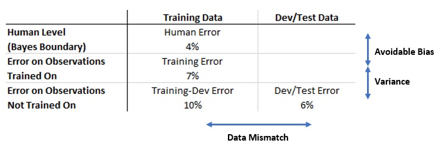

# Sampling, Bias-Variance Analysis and Mismatched Data Distribution

Yang Xi 
30 Sep 2020

 

* Sampling
	* Distributions of Training, Dev and Test Data Sets
	* Size of Training, Dev and Test Data Sets
	* Compare with Cross Validation
* Bias-Variance Analysis
	* Human-Level Performance and Bayes Boundary
	* Avoidable Bias
* Mismatched Data Distribution
	* Bias and Variance with Mismatched Data Distribution
	* How to Address Mismatched Data Distribution
* References

 

 

## Sampling

Sampling refers to the process which divides the entire data into training, dev, and test data sets.
* **Training set** is what model is trained on
* **Dev set** is for tuning and comparing the models
* **Test set** is to reflect real-world performance, as well as to prevent overfitting on the dev set.

Here I won't discuss the distribution by feature classes (such as stratified sampling), while I will focus more on high-level strategies.

 

### Distributions of Training, Dev and Test Data Sets

It is very important to take note that:
* **Dev and test sets must reflect the real-world data**, which you expect to see in future.
    * Sometimes this can be tricky
* **Dev and test sets must have the same distribution**
    * Recommend to shuffle the dev and test set, and divide into dev and test sets again.
    * Training set does NOT need to have the same distribution. 
    However, in this case we will have a **mismatch data problem**, which will be discussed in later sections.

 

### Size of Training, Dev and Test Data Sets

In classic problem, where we usually have 100 to 10,000 observations, we usually do
* Training (60%) - Dev (20%) - Test (20%)

While as we have more data, we can put more in the training set. 
For example, if we have 1 million observation, we can consider
* Training (98%) - Dev (1%) - Test (1%)

The **rule of thumb** is: the test set should be big enough to give high confidence in the overall performance of your model.

 

### Compare with Cross Validation

K-fold cross validation is commonly used to estimate the out-of-sample error. 
* When the **data set is hugh**, cross validation will become computational infeasible, while the dev set is big enough to reflect the out-of-sample error.
* When the **data set is very small**,  neither train/dev split nor cross-validation will be feasible. 
In this case, **leave-one-out** validation is more suitable.
* Cross-validation should NOT replace test set.

 

## Bias-Variance Analysis

What is **overfitting**? This is not a straight-forward question to answer. 
**Bias-Variance Analysis** provides a deeper understanding of overfitting. Most importantly, it helps to **prioritize what to do next**.

 

### Human-Level Performance and Bayes Boundary
** Human-level performance** general refers to the performance achieved by a group of human experts. 
**Bayes Boundary** is the theoretical performance boundary of a problem - no model nor human could surpass it. 
In some problems, especially **natural perception task** (like image classification), human can be very capable, so that the human error can be a proxy of Bayes error.

During model iterations, it's usually pretty fast to achieve close to human-level performance, while the progress will slow down significantly to surpass human level performance and getting closer to Bayes boundary.

As long as your model performs worse than humans, you can:
* Get labeled data from humans
* Gain insight from manual error analysis
* Better analysis of bias/variance

 

### Avoidable Bias
The difference between the training error and the Bayes error is called **Avoidable Bias**.

For example, you have a model like this:
* Human error: 1%
* Training error: 8%
* Dev error: 10%
You would prioritize on reducing bias - improving performance on the training set.

Alternatively, if human error is 7.5%, then you would prioritize on reducing variance.

 

## Mismatched Data Distribution

Sometime you could get into this situation:
* You only have small amount of data which could reflect your real-world use case.
    * Too little to achieve satisfying performance.
* While you have big amount of data relevant to your use case
    * You can achieve good model performance on this data - but - the result is not what you want!

For example, you want to built a mobile app "cat identifier":
* You have 10,000 images from mobile app, which are generally blur
* You have 200,000 images from webpages, which have high quality

In this case, instead of shuffling all images together, a better option could be:
* training set: 200,000 images from webpages+ 5,000 mobile app images
* dev set: 2,500 mobile app images
* test set: 2,500 mobile app images

Now you have a **mismatched data distribution** problem!

Take note that, a mismatched data distribution problem does NOT necessarily caused by manual process. 
This problem can be introduced during splitting of your data, without being noticed. Later we will see how to detect it.

 

### Bias and Variance with Mismatched Data Distribution

For example, you have a model like this:
* Bayes error: 0%
* Training error: 1%
* Dev error: 10%

With **mismatched data distribution** in consideration, you cannot directly conclude that the 9% gap between training error and dev error is due to variance.

In this case, one solution is to make a **training-dev data set**, which has the same distribution as the training set, but not used for training.
* Now you train your model only on the training set, the evaluate on the training-dev set.
    * If you get 9% training-dev error, there is a variance problem.
    * If you get 2% training-dev error, there is a data mismatch problem.

 

Another example with more **general formulation**:

In the case, if we managed to get the human level performance on the dev/test set, say it's 6%, we can see that the 6% dev/test error is actually already very good.

 

### How to Address Mismatched Data Distribution
Besides collecting more data similar to dev/test sets, you can consider other options:
* Carry out manual error analysis to understand the difference between training and dev/test sets.
    * I will discuss error analysis in separate markdown.
* Make training data more similar to dev/test sets.
    * For example, artificial data synthesis is widely used in speech recognition.

 

## References
* [(2020 Andrew Ng) Structuring Machine Learning Projects](https://www.coursera.org/learn/machine-learning-projects)
* [(2017 Trevor & Robert) The Elements of Statistical Learning](hhttp://web.stanford.edu/~hastie/Papers/ESLII.pdf)
