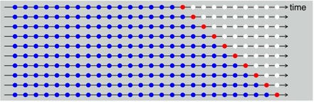

```{r setup, include=FALSE}
knitr::opts_chunk$set(echo = TRUE, warning = FALSE)
```

<br>

# Preface
This set of markdowns is my illustration of key contents from [Forecasting: principles and practice](https://OTexts.org/fpp2/) by Rob J Hyndman and George Athanasopoulos.

<br>

# 1. Definition
### 1.1 Time Series Patterns
Time Series have three basic patterns:

* Trend: A pattern exists involving a long-term increase or decrease in the data
* Seasonal: A periodic pattern exists due to the calendar (e.g. the quarter, month, or day of the week)
* Cyclic: A pattern exists where the data exhibits rises and falls that are not of fixed period (duration usually of at least 2 years)

<br>
The cyclic pattern possesses some characters different from seasonal pattern:

*	Seasonal pattern has constant period, while period of cyclic pattern can be variable
*	Average length of cycle is longer than length of seasonal pattern
*	Magnitude of cycle is more variable than magnitude of seasonal pattern

<br>

### 1.2 White Noise
A white noise signal is a time series of independent and identically distributed (iid) data. Figure below is a simulated white noise signal:

```{r, message=FALSE}
library(dplyr)
library(fpp2)

set.seed(1)
wn <- ts(rnorm(731), start=c(1,1), frequency=91)  # White noise
autoplot(wn) 
```
<br>

### 1.3 Autocorrelation Function (ACF)
Autocorrelation is the correlation of a series with a delayed copy of itself as a function of delay. It can be interpreted as the similarity between observations as a function of the time lag between them. ACF is a tool to identify repeating patterns, or periodicity of a time series.
<br>
A white noise signal yields ACF values close to 0. The ACF plot of the simulated noise signal is demonstrated as below:
```{r}
ggAcf(wn)
```
<br>
The cut-off lines (dashed blue) are determined by sample distribution. 95% of all ACF values for white noise should lie within the blue lines. If not, the series is probably not white noise.

<br>
In contrast, the ACF plot of a daily sales data of an item has many values outside the cut-off lines as shown below:
```{r}
dfItemB <- read.csv('data/time_series_daily_B.csv')

# Convert to ts
tsB <- select(dfItemB, -date)
row.names(tsB) <- dfItemB$date
tsB_p <- 91 # 91 days in one quarter (decimal frequency may result fail in seasonal model)
tsB <- ts(tsB, start=c(1, 1), frequency=tsB_p)
tsBs <- tsB[,'sales_qty']
autoplot(tsBs)

acfBs <- ggAcf(tsBs)
acfBs
message("The max ACF occurs at ", acfBs$data$lag[which.max(acfBs$data$Freq)], " days of lag.")

```
<br>
In addition, the periodicity of this time series can be identified from the ACF plot:

* The peak value occurs at 91 days of lag, which reflects the quarterly seasonality;
* The weekly pattern (7 days) and its harmonics are also clearly shown by the ACF.

<br>

### 1.4 Ljung-Box Test
The Ljung-Box test is a significant test to evaluate the likelihood of a time series being white noise. It considers the first h autocorrelation values together. A small p-value indicates the time series is probably not white noise.

<br>
Section below compares the results of Ljung-Box tests of the above white noise and the sales data:

* Ljung-Box test result of white noise:
```{r}
Box.test(wn, lag = tsB_p, type = "Ljung-Box")
```

* Ljung-Box test result of the sales data:
```{r}
Box.test(tsBs, lag = tsB_p, type = "Ljung-Box")
```

<br>

# 2. Performance Evaluation
### 2.1 Residuals
The residuals resulted from a valid forecast model is expected to look like white noise, which possesses useful properties of estimating prediction intervals:

*	Uncorrelated
* Zero mean
* Constant variance
* Normally distributed

<br>

### 2.2 Forecast Accuracy Measurements
There are various measurements with different limitations. This section will list several common ones.<br>
Let<br>
$y_{t}$ = actual values<br>
$\hat{y_{t}}$ = forecasted values<br>
$e_{t}$ = forecast error = $y_{t}-\hat{y_{t}}$

<br>
**Mean Squared Error (MSE) and Root Mean Squared Error (RMSE)**
$$ MSE=mean(e_{t}^{2})$$
$$ RMSE=\sqrt{MSE} $$
**Mean Absolute Percentage Error (MAPE)**
$$ MAPE=100\times mean(|\frac{e_{t}}{y_{t}}|)   $$
**Coefficient of Variation**
$$ \text{coefficient of variation}=\frac{RMSE}{\bar{y_{t}}} $$
**Mean Absolute Scaled Error (MASE)**
$$ MASE=\frac{\sum |e_{t}|}{\sum(y_{t}-y_{t-1})} $$
**MASE** will be used as the primary accuracy measurements in the following illustrations, because MASE has the following properties:

* Scale invariance: independent of the scale of the data
* Predictable behavior in case that $y_{t}\rightarrow 0$
* Symmetry: penalizes positive and negative forecast errors equally, and penalized errors in large forecasts and small forecasts equally
* Interpretability: MASE=1 is equivalent to one-step naïve method. MASE less than 1 indicates between accuracy than one-step naïve method.
* Asymptotic normality: the Diebold-Mariano test statistics of MASE has been empirically shown to approximate normal distribution.

Besides MASE, RMSE will also be used as a reference.

<br>

### 2.3 Time Series Cross-Validation (tsCV)
The formation of validation sets in tsCV is different from non-time-series cross-validation. This will be explained through the following example:

```{r, echo=FALSE, fig.align="center", out.width = '60%'}

```
<br>
The figure above demonstrates the tsCV validation sets (folds) of a 1-step forecast. Each line presents one validation set, where the blue dots are the training data, and the red dots are the test data. As shown, the validate sets are formed on a moving basis. In addition, the length of the test set and the number of folds can be determined based on the purpose of the model.

<br>


